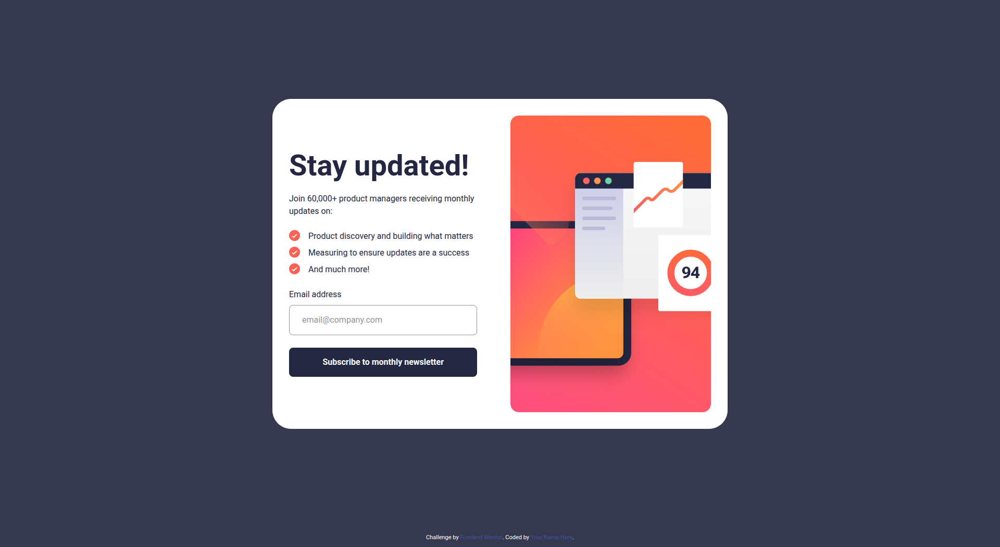

# Frontend Mentor - Newsletter sign-up form with success message solution

This is a solution to the [Newsletter sign-up form with success message challenge on Frontend Mentor](https://www.frontendmentor.io/challenges/newsletter-signup-form-with-success-message-3FC1AZbNrv). Frontend Mentor challenges help you improve your coding skills by building realistic projects.

## Overview

A responsive newsletter sign-up form with client-side validation and a success message. This is the completed project from the Frontend Mentor challenge "Newsletter sign-up form with success message" and includes HTML, SCSS, and JavaScript.

### Screenshot

### Links

## Features

- Responsive layout (mobile and desktop)
- Email input validation (required + format)
- Success message showing the entered email after submit
- Accessible focus/hover states

## Built With

- HTML5
- SCSS (Sass) — compiled to CSS
- Vanilla JavaScript

## Acknowledgments

- Challenge by [Frontend Mentor](https://www.frontendmentor.io).
